# UML-OOAD / Objektorientierte Analyse und Design / Übungszettel UML

# Objektorientierte Analyse 

Objektorientierte Analyse und Design (OOAD) sind objektorientierte Varianten der zwei allgemeinen Tätigkeiten Anforderungsanalyse (objektorientierte Analyse) und Systementwurf (Obejktorientiertes Design) im Entwicklungsprozess eines Softwaresystems.

Als Standardnotation für objektorientierte Modelle hat sich die Unified Modeling Language (kurz UML) etabliert. Ein Vorgehensmodell, das speziell für objektorientierte Techniken und die UML entwickelt wurde, ist der sogenannte Rational Unified Process (RUP).

Die Objektorientierte Analyse (OOA) ist der erste Schritt des OOAD-Prozesses. Hierbei wird das zu entwickelnde System analysiert, um ein besseres Verständnis seiner Anforderungen und Funktionalitäten zu erlangen. Der Fokus liegt dabei auf der Identifikation von Objekten im System, die miteinander interagieren, um das Problem zu lösen. In der OOA werden die Anforderungen des Systems identifiziert, relevante Objekte identifiziert und beschrieben, ein Objektmodell erstellt, Beziehungen zwischen Objekten definiert und das Verhalten der Objekte spezifiziert.

Die Objektorientierte Design (OOD) ist der zweite Schritt des OOAD-Prozesses. In diesem Schritt werden die Ergebnisse der OOA genommen und auf der Grundlage der Anforderungen und Funktionalitäten des Systems ein Design erstellt. Das Ziel der OOD ist es, ein Systemdesign zu erstellen, das das System effektiv und effizient lösen kann. Es gibt verschiedene Designprinzipien, wie z.B. das Prinzip der Vererbung, der Polymorphie und der Abstraktion, die während der OOD angewendet werden.

Zusammenfassend ist OOAD ein Prozess, der darauf abzielt, ein System auf der Grundlage der OOP-Prinzipien zu entwickeln. Es umfasst die Objektorientierte Analyse (OOA) und das Objektorientierte Design (OOD) als zwei separate Schritte, die aufeinander aufbauen. Das Ergebnis des OOAD-Prozesses ist ein detailliertes Design, das als Grundlage für die Implementierung des Systems dient.

## Ziele:
Dadurch, dass in den Entwicklungsphasen Analyse und Design bereits objektorientierte Techniken eingesetzt werden, wird der Übergang zur Implementierung in einer objektorientierten Programmiersprache erleichtert.

- Verständnis der Anforderungen: Der erste Schritt bei der OOAD ist das Verständnis der Anforderungen an das System. Dies umfasst die Identifizierung der Bedürfnisse und Anforderungen der Benutzer sowie die Funktionalität, die das System bereitstellen soll.

- Modellierung des Systems: Das nächste Ziel der OOAD ist die Modellierung des Systems mithilfe von Objekten und Klassen. Hierbei werden die Anforderungen des Systems in ein Modell übertragen, das eine detaillierte Darstellung der Systemkomponenten und -funktionen bietet.

- Erstellung von Klassen und Objekten: Auf der Grundlage des erstellten Modells werden Klassen und Objekte erstellt, um das System funktionsfähig zu machen. Dies beinhaltet die Festlegung von Attributen und Methoden sowie die Zuweisung von Funktionen und Eigenschaften an die einzelnen Objekte.

- Implementierung des Systems: Nach der Erstellung der Klassen und Objekte wird das System implementiert, indem der Code geschrieben und getestet wird. Hierbei werden auch geeignete Software-Tools verwendet, um die Programmierung und das Debugging zu erleichtern.

- Wartung und Weiterentwicklung des Systems: Ein weiteres Ziel der OOAD ist die Wartung und Weiterentwicklung des Systems, um sicherzustellen, dass es weiterhin den Anforderungen entspricht und effektiv arbeitet. Hierbei werden auch Änderungen und Erweiterungen an der Software vorgenommen, um die Leistung und Funktionalität des Systems zu verbessern.

Insgesamt zielt die OOAD darauf ab, ein effektives und effizientes System zu schaffen, das den Bedürfnissen der Benutzer entspricht und leicht wartbar und erweiterbar ist.

## Requirements:
Anforderungen für die Objektorientierte Analyse und Design

- Funktionale Anforderungen: Dies sind die spezifischen Anforderungen an die Funktionen, die das System bereitstellen soll. Beispielsweise könnte eine Anforderung sein, dass das System in der Lage sein muss, Daten zu speichern und abzurufen.

- Nicht-funktionale Anforderungen: Diese beziehen sich auf Eigenschaften des Systems, die nicht direkt mit seiner Funktionalität zusammenhängen. Beispiele hierfür sind die Leistung, Skalierbarkeit, Sicherheit, Benutzerfreundlichkeit und Wartbarkeit.

- Benutzeranforderungen: Diese Anforderungen beschreiben die Bedürfnisse und Erwartungen der Benutzer des Systems. Sie umfassen Aspekte wie Benutzeroberfläche, Datenzugriff und -manipulation, Integration mit anderen Systemen und ähnliches.

- Systemumgebung: Dies bezieht sich auf die Umgebung, in der das System ausgeführt wird, einschließlich Hardware, Betriebssystem, Netzwerk und ähnliches. Es ist wichtig, dass das System in der Umgebung, in der es betrieben wird, ordnungsgemäß funktioniert.

- Gesetzliche und regulatorische Anforderungen: Je nach Art des Systems müssen auch gesetzliche und regulatorische Anforderungen berücksichtigt werden, wie beispielsweise Datenschutz, Barrierefreiheit, Datenschutz und ähnliches.

Insgesamt ist es wichtig, alle relevanten Anforderungen zu identifizieren und zu dokumentieren, um sicherzustellen, dass das System den Bedürfnissen der Benutzer entspricht und effektiv arbeitet.

## Strukturelle Modellierung:
Die strukturelle Modellierung ist ein wichtiger Teil der Objektorientierten Analyse und Design (OOAD). Hierbei werden die statischen Aspekte des Systems modelliert, wie die Klassen und Objekte sowie deren Beziehungen zueinander. Die strukturelle Modellierung besteht aus folgenden Elementen:

- Klassen: Eine Klasse ist eine abstrakte Darstellung eines Konzepts oder einer Entität im System, die Eigenschaften und Verhaltensweisen besitzt. Klassen können Attribute (Eigenschaften) und Methoden (Funktionen) haben, die die Verhaltensweisen der Klasse definieren.

- Objekte: Objekte sind Instanzen von Klassen und repräsentieren spezifische Entitäten oder Konzepte im System. Jedes Objekt hat einen Zustand, der durch seine Attribute beschrieben wird, und kann verschiedene Methoden ausführen, um seine Verhaltensweisen zu definieren.

- Beziehungen: Beziehungen beschreiben, wie Objekte und Klassen im System miteinander verbunden sind. Es gibt verschiedene Arten von Beziehungen, wie beispielsweise die Assoziation, die Vererbung und die Aggregation.

    - Assoziation: Eine Assoziation beschreibt eine Beziehung zwischen zwei Klassen, die angibt, dass Objekte der einen Klasse Objekte der anderen Klasse kennen oder darauf zugreifen können.

    - Vererbung: Vererbung beschreibt eine Beziehung zwischen Klassen, bei der eine Klasse (die Subklasse) die Eigenschaften und Verhaltensweisen einer anderen Klasse (der Superklasse) erbt. Dies ermöglicht es, Klassen hierarchisch zu organisieren und gemeinsame Eigenschaften und Verhaltensweisen zu definieren.

    - Aggregation: Aggregation beschreibt eine Beziehung zwischen Klassen, bei der eine Klasse (der Aggregator) eine oder mehrere Instanzen einer anderen Klasse (der Aggregatklasse) besitzt. Aggregation ermöglicht es, komplexe Systeme durch die Kombination von kleineren Teilen zu modellieren.

Durch die strukturelle Modellierung können die statischen Aspekte des Systems klar und präzise modelliert werden, um ein besseres Verständnis des Systems zu erreichen und eine Grundlage für die Implementierung zu schaffen.

## Dynamische Modellierung:
Die Dynamische Modellierung ist ein wichtiger Teil der Objektorientierten Analyse und Design (OOAD). Hierbei werden die dynamischen Aspekte des Systems modelliert, wie die Abläufe und Prozesse im System, die durch die Interaktionen zwischen den Objekten ausgelöst werden. Die Dynamische Modellierung besteht aus folgenden Elementen:

- Zustandsdiagramme: Ein Zustandsdiagramm beschreibt den Lebenszyklus eines Objekts und zeigt die verschiedenen Zustände, die es durchlaufen kann, sowie die Ereignisse, die diese Zustände auslösen. Zustandsdiagramme sind nützlich, um komplexe Verhaltensweisen zu modellieren und zu verstehen, wie ein Objekt auf Ereignisse reagiert.

- Sequenzdiagramme: Ein Sequenzdiagramm zeigt die Interaktionen zwischen Objekten in einer bestimmten Sequenz, um einen bestimmten Zweck zu erfüllen. Es beschreibt die Reihenfolge der Nachrichten, die zwischen den Objekten ausgetauscht werden, um eine bestimmte Funktion auszuführen. Sequenzdiagramme sind nützlich, um die Interaktionen zwischen Objekten zu verstehen und zu modellieren.

- Aktivitätsdiagramme: Ein Aktivitätsdiagramm beschreibt den Ablauf eines Prozesses oder einer Funktion und zeigt, wie verschiedene Aktionen und Entscheidungen in einer bestimmten Sequenz ausgeführt werden. Es kann auch die Parallelität und die Bedingungen, die den Ablauf beeinflussen, modellieren. Aktivitätsdiagramme sind nützlich, um komplexe Prozesse oder Funktionen zu verstehen und zu modellieren.

- Kollaborationsdiagramme: Ein Kollaborationsdiagramm zeigt die Interaktionen zwischen Objekten, die zusammenarbeiten, um eine bestimmte Funktion auszuführen. Es beschreibt die Nachrichten, die zwischen den Objekten ausgetauscht werden, um Informationen zu teilen und Funktionen auszuführen. Kollaborationsdiagramme sind nützlich, um die Interaktionen zwischen Objekten zu verstehen und zu modellieren.

Durch die Dynamische Modellierung können die dynamischen Abläufe und Prozesse im System klar und präzise modelliert werden, um ein besseres Verständnis des Systems zu erreichen und eine Grundlage für die Implementierung zu schaffen.

# 
# 
# Anforderungsanalyse mit Anwendungsfällen
Arbeite dich in die Grundprinzipien der Anforderungsanalyse mit USE-Cases (Diagramm + textuelle Beschreibung + Mockup) ein.

## Grundlagen
Die Anforderungsanalyse mit Anwendungsfällen (Use Cases) ist eine Methode zur Erfassung, Analyse und Dokumentation von funktionalen Anforderungen für ein Softwaresystem aus der Perspektive der Benutzer. Im Gegensatz zu User Stories, die auf eine bestimmte Benutzeraktion und das gewünschte Ergebnis fokussiert sind, beschreiben Anwendungsfälle detaillierter die Interaktionen zwischen Benutzern (Akteuren) und dem System.

Hier sind einige Grundlagen zur Anforderungsanalyse mit Anwendungsfällen:

- Akteure:
Akteure repräsentieren die Rollen von Personen, anderen Systemen oder Organisationen, die mit dem System interagieren. Sie können primär (direkt) oder sekundär (indirekt) mit dem System interagieren.

- Anwendungsfälle:
Ein Anwendungsfall ist ein Szenario, das eine bestimmte Funktionalität des Systems beschreibt und wie ein Akteur mit dem System interagiert, um ein bestimmtes Ziel zu erreichen. Anwendungsfälle bestehen aus einer Reihe von Schritten oder Abläufen, die die Interaktion zwischen Akteuren und dem System beschreiben.

- Anwendungsfallspezifikation:
Die Anwendungsfallspezifikation ist die detaillierte Beschreibung eines Anwendungsfalls. Sie enthält typischerweise Informationen wie:
    - Name des Anwendungsfalls
    - Beschreibung oder Ziel des Anwendungsfalls
    - Akteure, die am Anwendungsfall beteiligt sind
    - Vorbedingungen (Bedingungen, die vor der Ausführung des Anwendungsfalls erfüllt sein müssen)
    - Nachbedingungen (Zustand des Systems nach der Ausführung des Anwendungsfalls)
    - Normaler Ablauf (Schritte, die im normalen Verlauf der Interaktion stattfinden)
    - Alternative Abläufe (alternative Schritte oder Verzweigungen, die auftreten können)
    - Ausnahmen oder Fehlerbedingungen (Szenarien, in denen der Anwendungsfall fehlschlägt oder abgebrochen wird)

- Anwendungsfalldiagramme:
Anwendungsfalldiagramme sind visuelle Darstellungen von Anwendungsfällen und ihren Beziehungen zu Akteuren. Sie sind Teil der Unified Modeling Language (UML) und helfen dabei, die Anforderungen und Interaktionen eines Systems auf einen Blick zu erfassen.

- Schritte zur Erstellung von Anwendungsfällen:
    - Identifizierung der Akteure: Identifizieren Sie die verschiedenen - -   Rollen, die mit dem System interagieren.
    - Identifizierung der Anwendungsfälle: Ermitteln Sie die verschiedenen Szenarien, in denen Akteure mit dem System interagieren, um ihre Ziele zu erreichen.
    - Erstellung von Anwendungsfallspezifikationen: Beschreiben Sie die Anwendungsfälle detailliert, einschließlich der Vorbedingungen, Nachbedingungen, normalen Abläufe, alternativen Abläufe und Fehlerbedingungen.
    - Erstellung von Anwendungsfalldiagrammen: Visualisieren Sie die Beziehungen zwischen Akteuren und Anwendungsfällen in einem Diagramm.


## Vorgehensweisen
Die Anforderungsanalyse mit Anwendungsfällen folgt einer strukturierten Vorgehensweise, um die funktionalen Anforderungen eines Systems zu erfassen und zu dokumentieren. Hier sind die üblichen Schritte, die bei der Anforderungsanalyse mit Anwendungsfällen verwendet werden:

1. Sammeln von Informationen:
Zu Beginn sollten Sie alle relevanten Informationen über das System und dessen Anforderungen sammeln. Dies kann durch Interviews, Workshops, Brainstorming-Sitzungen oder das Studium von Dokumenten und vorhandenen Systemen geschehen.

2. Identifizierung der Akteure:
Akteure sind die Personen, Systeme oder Organisationen, die mit dem zu entwickelnden System interagieren. Identifizieren Sie die verschiedenen Akteure und ihre Rollen, um ein klareres Bild der Interaktionen zu erhalten.

3. Identifizierung der Anwendungsfälle:
Ermitteln Sie die verschiedenen Szenarien, in denen Akteure mit dem System interagieren, um ihre Ziele zu erreichen. Anwendungsfälle repräsentieren typischerweise die Hauptfunktionen des Systems.

4. Dokumentation der Anwendungsfälle:
Für jeden identifizierten Anwendungsfall erstellen Sie eine detaillierte Anwendungsfallspezifikation. Diese sollte Informationen wie Name, Beschreibung, beteiligte Akteure, Vorbedingungen, Nachbedingungen, normaler Ablauf, alternative Abläufe und Ausnahmen enthalten.

5. Validierung der Anwendungsfälle:
Stellen Sie sicher, dass die Anwendungsfälle die Anforderungen der Stakeholder und Benutzer korrekt widerspiegeln. Überprüfen Sie die Anwendungsfälle mit den Stakeholdern und Benutzern, um Feedback zu erhalten und eventuelle Unklarheiten oder Lücken zu klären.

6. Anwendungsfalldiagramme erstellen:
Erstellen Sie Anwendungsfalldiagramme, um die Beziehungen zwischen den Akteuren und Anwendungsfällen visuell darzustellen. Diese Diagramme helfen, das Verständnis der Anforderungen und Interaktionen zu fördern und sind Teil der Unified Modeling Language (UML).

7. Priorisierung der Anwendungsfälle:
Priorisieren Sie die Anwendungsfälle, um festzulegen, welche Funktionen zuerst entwickelt oder implementiert werden sollen. Dies kann auf der Grundlage von Faktoren wie Geschäftswert, technischer Komplexität oder Abhängigkeiten zwischen den Anwendungsfällen erfolgen.

8. Anforderungsverfolgung und -management:
Verwenden Sie geeignete Werkzeuge und Prozesse, um die Anwendungsfälle und ihre Umsetzung im Laufe des Projekts zu verfolgen und zu verwalten. Dies stellt sicher, dass alle Anforderungen erfüllt werden und Änderungen angemessen verwaltet werden.


### Generelle Vorgehensmodelle

### Wasserfallmodell


### V-Modell
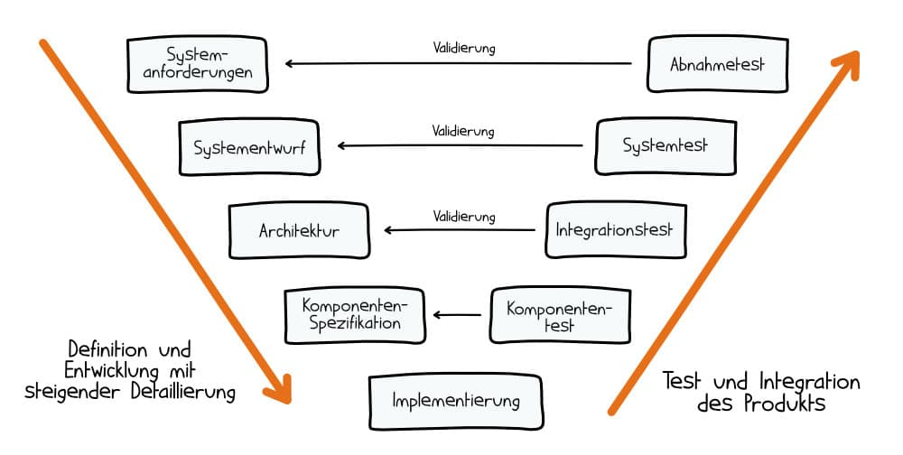


### Prototyp-Modell
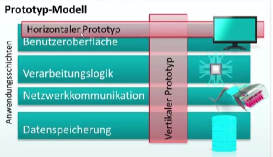


## Werkzeuge
Es gibt verschiedene Werkzeuge, die bei der Anforderungsanalyse mit Anwendungsfällen eingesetzt werden können, um den Prozess der Erstellung, Verwaltung und Kommunikation von Anwendungsfällen zu erleichtern. Hier sind einige gängige Werkzeuge:

- UML-Modellierungswerkzeuge:
Unified Modeling Language (UML) ist eine Standardnotation zur Modellierung von Softwaresystemen. UML-Modellierungswerkzeuge wie Enterprise Architect, Visual Paradigm, Lucidchart oder StarUML ermöglichen es Ihnen, Anwendungsfalldiagramme und andere UML-Diagramme zu erstellen und zu verwalten, um die Anforderungen und Interaktionen eines Systems besser zu visualisieren.

- Anforderungsmanagement-Software:
Werkzeuge wie IBM Rational DOORS, Jama Connect oder Helix ALM können zur Verwaltung und Dokumentation von Anwendungsfällen verwendet werden. Diese Werkzeuge unterstützen die Verwaltung von Anforderungen, Priorisierung, Zusammenarbeit, Verfolgung von Änderungen und Berichterstattung.

- Projektmanagement- und Kollaborationswerkzeuge:
Projektmanagement- und Kollaborationswerkzeuge wie Jira, Trello oder Azure DevOps können verwendet werden, um Anwendungsfälle und deren Umsetzung im Laufe des Projekts zu verfolgen. Sie unterstützen die Zusammenarbeit im Team, indem sie die Kommunikation, das Zuweisen von Aufgaben und das Verfolgen des Projektfortschritts erleichtern.

- Textverarbeitungs- und Tabellenkalkulationsprogramme:
Microsoft Word, Google Docs oder Excel können verwendet werden, um Anwendungsfälle und ihre Spezifikationen zu dokumentieren. Sie sind zwar nicht so leistungsfähig wie spezialisierte Anforderungsmanagement-Software, bieten jedoch einfache Möglichkeiten zur Erstellung, Formatierung und Speicherung von Dokumenten.

- Diagramm- und Grafikwerkzeuge:
Diagramm- und Grafikwerkzeuge wie Microsoft Visio, draw.io oder Creately können verwendet werden, um Anwendungsfalldiagramme und andere visuelle Darstellungen von Anwendungsfällen und ihren Beziehungen zu erstellen.

- Prototyping-Tools:
Werkzeuge wie Balsamiq, Sketch, Figma oder InVision können verwendet werden, um einfache Prototypen oder Wireframes des Systems zu erstellen. Diese können hilfreich sein, um das Verständnis der Anwendungsfälle zu vertiefen und Feedback von Benutzern und Stakeholdern zu erhalten.

## UI Mockups
UI (User Interface) Mockups spielen eine unterstützende Rolle bei der Anforderungsanalyse mit Anwendungsfällen. Sie sind visuelle Darstellungen des User Interfaces eines Systems und helfen, die Anforderungen und Benutzerinteraktionen besser zu veranschaulichen. Hier sind einige Gründe, warum UI Mockups im Zusammenhang mit der Anforderungsanalyse mit Anwendungsfällen nützlich sein können:

- Verständnis vertiefen:
UI Mockups helfen, die Anwendungsfälle und ihre Interaktionen mit dem System zu verdeutlichen. Sie bieten ein konkretes Bild davon, wie die Benutzer das System verwenden und wie die Anwendungsfälle in der Benutzeroberfläche repräsentiert werden.

- Kommunikation verbessern:
Mockups dienen als gemeinsame Referenz für Teammitglieder, Stakeholder und Kunden. Sie helfen, die Kommunikation und das gemeinsame Verständnis der Anforderungen zu fördern, indem sie ein visuelles Hilfsmittel bieten, das leichter zu verstehen ist als reiner Text.

- Benutzerfeedback einholen:
UI Mockups können verwendet werden, um frühzeitig Feedback von Benutzern und Stakeholdern zu erhalten. Dadurch können mögliche Probleme oder Verbesserungsmöglichkeiten in Bezug auf Benutzerfreundlichkeit, Design und Funktionalität identifiziert werden, bevor die Entwicklung beginnt.

- Anforderungen validieren:
Durch die Visualisierung der Anwendungsfälle in UI Mockups kann das Team überprüfen, ob die Anforderungen korrekt verstanden und umgesetzt wurden. Dies hilft, Unklarheiten und Lücken in der Anforderungsanalyse zu identifizieren und zu beheben.

- Zusammenarbeit fördern:
UI Mockups können zur Diskussion und Zusammenarbeit innerhalb des Teams beitragen, indem sie eine gemeinsame Grundlage für Ideen und Entscheidungen bieten.

Obwohl UI Mockups keine direkte Rolle in der Anforderungsanalyse mit Anwendungsfällen spielen, tragen sie dazu bei, die Anwendungsfälle und Anforderungen besser zu vermitteln und das Verständnis der Benutzerinteraktionen zu verbessern. Sie sind eine wertvolle Ergänzung, die den Analyseprozess unterstützt und die Qualität des entwickelten Systems verbessern kann.

## Dokumentation
Dokumentiere die wesentlichen Aspekte sowie deine persönlichen Lernergebnisse.

Bei der Anforderungsanalyse mit Anwendungsfällen ist es wichtig, die Anwendungsfälle und ihre zugehörigen Informationen klar und strukturiert zu dokumentieren. Die Dokumentation sollte alle relevanten Informationen enthalten, um ein gemeinsames Verständnis der funktionalen Anforderungen zu gewährleisten. Hier sind einige Schritte zur Dokumentation von Anwendungsfällen:

- Anwendungsfallspezifikation erstellen:
Für jeden identifizierten Anwendungsfall sollte eine Anwendungsfallspezifikation erstellt werden.
    - Name des Anwendungsfalls
    - Kurze Beschreibung oder Ziel des Anwendungsfalls
    - Beteiligte Akteure (Benutzer, Systeme oder Organisationen, die mit dem System interagieren)
    - Vorbedingungen (Bedingungen, die vor der Ausführung des Anwendungsfalls erfüllt sein müssen)
    - Nachbedingungen (Zustand des Systems nach der Ausführung des Anwendungsfalls)
    - Normaler Ablauf (Schritte, die im normalen Verlauf der Interaktion stattfinden)
    - Alternative Abläufe (alternative Schritte oder Verzweigungen, die auftreten können)
    - Ausnahmen oder Fehlerbedingungen (Szenarien, in denen der Anwendungsfall fehlschlägt oder abgebrochen wird)

- Anwendungsfalldiagramme erstellen:
Anwendungsfalldiagramme sind visuelle Darstellungen der Anwendungsfälle und ihrer Beziehungen zu den beteiligten Akteuren. Erstellen Sie Anwendungsfalldiagramme, um die Interaktionen und Beziehungen zwischen den Anwendungsfällen und den Akteuren zu verdeutlichen. Verwenden Sie UML-Modellierungswerkzeuge wie Enterprise Architect, Visual Paradigm, Lucidchart oder StarUML, um die Diagramme zu erstellen und zu verwalten.

- Dokumentation organisieren:
Organisieren Sie die Anwendungsfallspezifikationen und Diagramme in einer strukturierten und leicht zugänglichen Weise. Dies kann in Form von Dokumenten, Wikis oder durch den Einsatz von Anforderungsmanagement-Software erfolgen. Stellen Sie sicher, dass alle Teammitglieder Zugang zu den Dokumenten haben und Änderungen verfolgt werden können.

- Prototypen oder Wireframes erstellen (optional):
Erstellen Sie Prototypen oder Wireframes des Systems, um ein besseres Verständnis der Anwendungsfälle zu erhalten und das Design und die Benutzererfahrung zu veranschaulichen. Dies kann mit Hilfe von Prototyping-Tools wie Balsamiq, Sketch, Figma oder InVision erfolgen. Fügen Sie diese Visualisierungen in Ihre Dokumentation ein, um sie für die Teammitglieder und Stakeholder verfügbar zu machen.

- Überprüfung und Validierung:
Laden Sie die Stakeholder und Teammitglieder ein, die Anwendungsfalldokumentation zu überprüfen und Feedback zu geben. Dies stellt sicher, dass alle Anforderungen korrekt erfasst wurden und mögliche Unklarheiten oder Lücken geklärt werden.

#
#

# Anforderungsanalyse mit User Stories und Epics
Arbeite dich in die Grundprinzipien der Anforderungsanalyse mit User-Stories und Epics ein.

## Grundlagen
Anforderungsanalyse ist ein wichtiger Prozess in der Softwareentwicklung, bei dem die Bedürfnisse und Erwartungen der Benutzer ermittelt und dokumentiert werden. User Stories und Epics sind zwei gängige Werkzeuge, die in agilen Entwicklungsframeworks wie Scrum verwendet werden, um Anforderungen zu erfassen und zu organisieren.

- User Stories:
User Stories sind kurze, einfache Beschreibungen einer Funktion aus der Perspektive eines Endbenutzers. Sie bestehen aus drei Hauptelementen:

1. Rolle (Wer): Beschreibt die Art des Benutzers oder die Rolle, die die Funktion nutzen wird.
2. Funktion (Was): Beschreibt die gewünschte Aktion oder das gewünschte Ergebnis.
3. Nutzen (Warum): Beschreibt den erwarteten Wert oder Vorteil, den der Benutzer durch die Funktion erhält.
User Stories folgen oft dieser Struktur: "Als [Rolle] möchte ich [Funktion], um [Nutzen] zu erzielen."

Ein Beispiel: "Als Online-Shop-Kunde möchte ich die Möglichkeit haben, meine Lieferadresse zu ändern, damit meine Bestellung an die richtige Adresse geliefert wird."

- Epics:
Epics sind größere, komplexere Anforderungen, die in mehrere kleinere User Stories aufgeteilt werden können. Sie sind oft schwer zu schätzen und erfordern mehrere Iterationen, um vollständig umgesetzt zu werden. Epics helfen, das Projekt in überschaubare Teile zu zerlegen, die leichter zu verwalten und umzusetzen sind.

Ein Beispiel für ein Epic: "Implementierung eines Kundenbindungsprogramms für den Online-Shop."

In diesem Fall könnte das Epic in mehrere User Stories aufgeteilt werden, wie zum Beispiel:

"Als Kunde möchte ich Treuepunkte für jeden Einkauf sammeln, um später Rabatte zu erhalten."
"Als Kunde möchte ich meine gesammelten Treuepunkte einsehen können, um meinen Fortschritt zu verfolgen."
"Als Shop-Administrator möchte ich Kundenbindungsprogramm-Regeln erstellen und ändern können, um das Programm anpassen zu können."
Zusammengefasst helfen User Stories und Epics dabei, Anforderungen in leicht verständliche und umsetzbare Teile zu zerlegen. Sie ermöglichen es Entwicklern und Stakeholdern, den Fortschritt zu verfolgen und den Fokus auf die Bedürfnisse der Benutzer zu richten.


## Vorgehensweisen
Bei der Anforderungsanalyse mit User Stories und Epics gibt es mehrere Vorgehensweisen, um effektiv und effizient zu arbeiten.

- Identifizierung der Stakeholder:
Identifizieren Sie zunächst alle relevanten Stakeholder, die an dem Projekt beteiligt sind oder von ihm betroffen sein könnten, wie z. B. Endbenutzer, Projektmanager, Entwickler und Kunden.

- Sammeln von Anforderungen:
Arbeiten Sie eng mit den Stakeholdern zusammen, um Anforderungen zu ermitteln und zu dokumentieren. Verwenden Sie Techniken wie Interviews, Workshops, Fragebögen und Beobachtungen, um ein klares Verständnis der Bedürfnisse und Ziele der Benutzer zu gewinnen.

- Erstellung von User Stories:
Schreiben Sie User Stories, die die Anforderungen aus der Perspektive des Benutzers beschreiben. Achten Sie darauf, dass die User Stories die Rolle, die Funktion und den Nutzen enthalten, und dass sie klar und prägnant formuliert sind.

- Identifizierung von Epics:
Suchen Sie nach größeren, komplexeren Anforderungen, die in mehrere User Stories aufgeteilt werden können, und erstellen Sie entsprechende Epics. Ein Epic sollte einen übergeordneten Zweck oder ein Ziel repräsentieren, das durch die zugehörigen User Stories erreicht werden soll.

- Priorisierung:
Arbeiten Sie mit den Stakeholdern zusammen, um die User Stories und Epics nach ihrer Dringlichkeit und Wichtigkeit zu priorisieren. Sie können Techniken wie die MoSCoW-Methode (Must-have, Should-have, Could-have, Won't-have) oder den Business-Value-Ansatz verwenden, um eine Rangfolge festzulegen.

- Planung und Schätzung:
Planen Sie die Umsetzung der User Stories und Epics in den entsprechenden Entwicklungszyklen (Sprints) und schätzen Sie die benötigte Zeit und Ressourcen. Sie können Schätztechniken wie Planning Poker oder T-Shirt-Größen verwenden, um die relativen Aufwände zu bestimmen.

- Überprüfung und Anpassung:
Überprüfen Sie regelmäßig den Fortschritt und passen Sie Ihre Prioritäten und Pläne entsprechend an. Agile Methoden legen Wert auf kontinuierliche Verbesserung und Flexibilität, um auf Veränderungen in den Anforderungen oder dem Projektumfeld reagieren zu können.

- Validierung und Abnahme:
Stellen Sie sicher, dass die umgesetzten User Stories und Epics die ursprünglichen Anforderungen erfüllen und von den Stakeholdern abgenommen werden. Dies gewährleistet, dass das Produkt die Bedürfnisse der Benutzer erfüllt und den gewünschten Wert liefert.

## Werkzeuge
Es gibt verschiedene Werkzeuge, die Ihnen bei der Arbeit mit User Stories und Epics helfen können. Einige dieser Werkzeuge sind speziell für die agile Softwareentwicklung konzipiert, während andere allgemeiner einsetzbar sind. Hier sind einige der gängigsten Werkzeuge:

- Jira:
Jira ist ein beliebtes Projektmanagement- und Bug-Tracking-Tool von Atlassian. Es unterstützt agile Methoden wie Scrum und Kanban und bietet Funktionen zum Erstellen, Organisieren und Priorisieren von User Stories und Epics. Jira ermöglicht auch die Planung von Sprints, die Schätzung von Aufwänden und die Überwachung des Fortschritts.

- Trello:
Trello ist ein visuelles Kollaborations- und Projektmanagement-Tool, das auf dem Kanban-Prinzip basiert. Sie können Trello-Boards, Listen und Karten verwenden, um User Stories und Epics zu erstellen, zu organisieren und zu verwalten. Trello eignet sich besonders für kleinere Teams und weniger komplexe Projekte.

- Azure DevOps (früher VSTS):
Azure DevOps ist eine Suite von DevOps-Tools von Microsoft, die eine Vielzahl von Funktionen wie Quellcodeverwaltung, Build-Automatisierung, Deployment und Projektmanagement bietet. Es unterstützt agile Methoden und ermöglicht die Verwaltung von User Stories, Epics, Sprints und Backlogs.

- GitLab:
GitLab ist eine webbasierte DevOps-Plattform, die Funktionen wie Versionskontrolle, Continuous Integration und Deployment, sowie Projektmanagement bietet. GitLab bietet ein Issue-Tracking-System, mit dem Sie User Stories und Epics erstellen, organisieren und verwalten können.

- Pivotal Tracker:
Pivotal Tracker ist ein agiles Projektmanagement-Tool, das speziell für Softwareentwicklungsteams entwickelt wurde. Es bietet Funktionen zum Erstellen und Verwalten von User Stories, Epics und Iterationen. Pivotal Tracker ermöglicht die Schätzung von Aufwänden, die Planung von Releases und die Visualisierung des Projektfortschritts.

- Taiga:
Taiga ist ein Open-Source-Projektmanagement-Tool für agile Teams. Es unterstützt Scrum und Kanban und

## Dokumentation
Bei der Anforderungsanalyse mit User Stories und Epics ist es wichtig, die Informationen klar und übersichtlich zu dokumentieren, um die Zusammenarbeit im Team zu erleichtern und Missverständnisse zu vermeiden. Hier sind einige Tipps zur Dokumentation von User Stories und Epics:

- User Stories:
User Stories sind kurze, einfache Beschreibungen einer Funktion oder eines Features aus der Perspektive des Benutzers.
- Epics:
Ein Epic ist eine größere, abstraktere Anforderung, die aus mehreren User Stories besteht. Epics sollten auch klar und verständlich dokumentiert werden, um das Gesamtziel und den Zusammenhang zwischen den zugehörigen User Stories zu verdeutlichen.
- Akzeptanzkriterien:
Akzeptanzkriterien sind spezifische Bedingungen, die erfüllt sein müssen, damit eine User Story als abgeschlossen betrachtet wird. Akzeptanzkriterien sollten klar und präzise formuliert werden, um sicherzustellen, dass alle Teammitglieder wissen, wann eine User Story abgeschlossen ist.

- Dokumentationstools:
Nutzen Sie Projektmanagement- und Kollaborationswerkzeuge wie Jira, Trello oder Azure DevOps, um User Stories und Epics zu dokumentieren und zu verwalten. Diese Werkzeuge ermöglichen es Ihnen, Anforderungen zu organisieren, Prioritäten festzulegen und den Fortschritt des Projekts zu verfolgen.

- Visuelle Darstellungen:
Verwenden Sie visuelle Darstellungen wie Story Maps, um den Zusammenhang zwischen User Stories und Epics zu verdeutlichen und die Reihenfolge der Umsetzung zu planen.

- Kommunikation und Zusammenarbeit:
Fördern Sie offene Kommunikation und Zusammenarbeit im Team, um sicherzustellen, dass alle Mitglieder über die Anforderungen und deren Bedeutung im Klaren sind. Halten Sie regelmäßige Meetings und Diskussionen ab, um gemeinsam an User Stories und Epics zu arbeiten und Probleme oder Unklarheiten zu klären.

#
#
# Wichtige UML-Diagrammarten
UML (Unified Modeling Language) ist eine standardisierte visuelle Modellierungssprache, die in der Softwareentwicklung verwendet wird, um die Struktur, das Verhalten und die Architektur von Softwaresystemen darzustellen. UML-Diagramme sind grafische Darstellungen, die verschiedene Aspekte eines Systems veranschaulichen und dabei verschiedene UML-Notationen verwenden.

## Klassendiagramm
### Einsatzzweck
Klassendiagramme sind ein wichtiges Werkzeug in der Softwareentwicklung und haben mehrere Einsatzzwecke, die dazu beitragen, ein besseres Verständnis der Struktur und Beziehungen innerhalb eines Softwaresystems zu erlangen:

- Systemdesign und -architektur:
Klassendiagramme helfen Entwicklern und Architekten, die Struktur und Architektur eines Softwaresystems zu entwerfen und zu visualisieren. Sie ermöglichen es, Klassen, Attribute, Methoden und Beziehungen zwischen Klassen zu identifizieren und zu organisieren, um ein kohärentes und effizientes Design zu erstellen.

- Analyse und Modellierung von Anforderungen:
Klassendiagramme können verwendet werden, um die Anforderungen eines Systems zu analysieren und zu modellieren. Sie helfen, die Hauptkonzepte, Entitäten und Beziehungen innerhalb des Systems zu identifizieren und deren Zusammenwirken zu verstehen.

- Kommunikation und Zusammenarbeit:
Klassendiagramme dienen als gemeinsame visuelle Sprache, die Teammitgliedern, Stakeholdern und Kunden hilft, die Struktur und Beziehungen innerhalb eines Systems besser zu verstehen. Sie erleichtern die Kommunikation und fördern die Zusammenarbeit bei der Planung, Entwicklung und Wartung von Softwareprojekten.

- Dokumentation:
Klassendiagramme sind ein effektives Mittel zur Dokumentation von Softwaresystemen. Sie bieten eine strukturierte und leicht verständliche Darstellung der Klassen, Attribute, Methoden und Beziehungen, die im System implementiert sind. Diese Dokumentation ist nützlich für das Verständnis, die Wartung und die Erweiterung des Systems im Laufe der Zeit.

- Codegenerierung:
Einige UML-Tools unterstützen die automatische Codegenerierung aus Klassendiagrammen. Dies kann die Entwicklung beschleunigen und Konsistenz zwischen Design und Code sicherstellen, indem Klassen, Attribute und Methoden direkt aus dem Klassendiagramm in den Programmcode übertragen werden.

Insgesamt sind Klassendiagramme ein wertvolles Werkzeug für die Planung, Analyse, Kommunikation und Dokumentation von Softwaresystemen. Sie tragen dazu bei, ein klareres Verständnis der Struktur und Beziehungen innerhalb eines Systems zu erlangen und die Qualität der entwickelten Software zu verbessern.


### Wesentliche Notationsformen
- Klassen: Klassen werden durch Rechtecke dargestellt, die in drei horizontale Abschnitte unterteilt sind. Der obere Abschnitt enthält den Klassennamen, der mittlere Abschnitt enthält die Attribute und der untere Abschnitt zeigt die Methoden.

- Attribute: Attribute sind Eigenschaften oder Daten, die einer Klasse zugeordnet sind. Sie werden im mittleren Abschnitt der Klasse aufgelistet und können den Datentyp, den Namen und den Standardwert des Attributs enthalten.

- Methoden: Methoden sind Operationen oder Funktionen, die von einer Klasse ausgeführt werden können. Sie werden im unteren Abschnitt der Klasse aufgelistet und können den Rückgabetyp, den Namen und die Parameter der Methode enthalten.

- Beziehungen zwischen Klassen: Beziehungen zwischen Klassen werden durch verschiedene Linien und Symbole dargestellt, die die Art der Beziehung anzeigen. Die häufigsten Beziehungstypen sind:

    - Assoziation: Eine einfache bidirektionale oder unidirektionale Beziehung zwischen zwei Klassen, die durch eine Linie dargestellt wird.

    - Aggregation: Eine "enthält"-Beziehung, bei der eine Klasse (der Container) eine Sammlung von Objekten einer anderen Klasse (Teilobjekte) enthält. Dies wird durch eine Linie mit einem offenen Diamanten am Ende des Containerobjekts dargestellt.

    - Komposition: Eine stärkere Form der Aggregation, bei der die Lebensdauer der Teilobjekte von der Lebensdauer des Containerobjekts abhängt. Dies wird durch eine Linie mit einem geschlossenen Diamanten am Ende des Containerobjekts dargestellt.

    - Vererbung (Generalisierung): Eine "ist-ein"-Beziehung zwischen einer Unterklasse (abgeleitete Klasse) und einer Oberklasse (Basisklasse). Dies wird durch eine Linie mit einem leeren Dreieck am Ende der Basisklasse dargestellt.

- Abhängigkeit: Eine Beziehung, bei der eine Klasse von einer anderen abhängt, zum Beispiel durch Nutzung ihrer Funktionen. Dies wird durch eine gestrichelte Linie mit einem offenen Pfeil am Ende der abhängigen Klasse dargestellt.


### Exemplarische Anwendung Beispiel
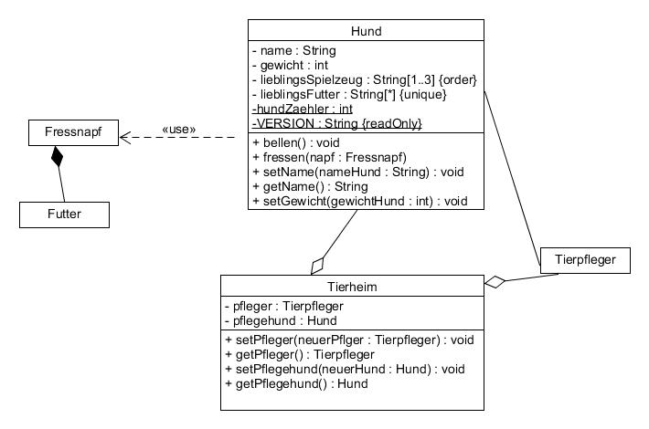

In diesem Beispiel, sehen wir ein Klassendiagramm von einem Tierheim.

Es gibt eine Beziehung zwischen der Klasse Hund und der Klasse Tierpfleger, gekennzeichnet durch die einfache Verbindungslinie. Beide Klassen können ohne die andere exisitieren.

Zwischen Hund und Fressnapf, besteht eine sogenannte Verwendungsbeziehung, erkennbar an der strichlierten Verbindung.

Das Tierheim besitzt Datenfelder (Instanzen) vom Typ Tierpfleger und vom Typ Hund.
Die Beziehung zwischen Tierpfleger und Tierheim, sowie Hund und Tierheim mit der leeren Diamantnotation wird als Aggregation bezeichnet. Dies bedeutet, dass die Klasse Hund und Klasse Tierpfleger auch ohne ein Tierheim exitieren können.

Hingegen wird die Beziehung zwischen Fressnap und Futter mit der ausgefüllten Diamantnotation als Komposition bezeichnet. Bei diesem Assoziationstyp ist die Beziehung so stark, dass mit dem Löschen des „Behälterobjekts“ auch das integrierte Objekt verschwindet.


## Sequenzdiagramm
### Einsatzzweck
Sequenzdiagramme sind eine Art von Verhaltensdiagramm in der Unified Modeling Language (UML), das zur Darstellung von Interaktionen und Kommunikation zwischen Objekten in einem Softwaresystem verwendet wird. Sie zeigen die zeitliche Abfolge von Nachrichten, die zwischen Objekten ausgetauscht werden, und wie diese Nachrichten in zeitlicher Reihenfolge verarbeitet werden. Sequenzdiagramme haben mehrere Einsatzzwecke:

- Analyse von Interaktionen und Abläufen:
Sequenzdiagramme ermöglichen die Analyse von Interaktionen und Abläufen innerhalb eines Systems. Sie zeigen, wie Objekte miteinander kommunizieren und wie sie auf eingehende Nachrichten reagieren. Diese Informationen sind nützlich, um den Informationsfluss, die Abhängigkeiten und die Kollaboration zwischen Objekten besser zu verstehen.

- Identifikation von Systemkomponenten und Schnittstellen:
Sequenzdiagramme helfen Entwicklern, Systemkomponenten und ihre Schnittstellen zu identifizieren. Sie zeigen, welche Objekte miteinander interagieren und welche Nachrichten sie austauschen. Diese Informationen sind hilfreich, um die Struktur und Architektur des Systems zu entwerfen und zu planen.

- Veranschaulichung von Anwendungsfällen und Szenarien:
Sequenzdiagramme können verwendet werden, um Anwendungsfälle und Szenarien in einem System zu veranschaulichen. Sie zeigen, wie verschiedene Objekte zusammenarbeiten, um bestimmte Anforderungen und Funktionen des Systems zu erfüllen. Dies hilft Entwicklern und Stakeholdern, die Funktionsweise und den Ablauf von Anwendungsfällen besser zu verstehen.

- Kommunikation und Zusammenarbeit:
Sequenzdiagramme dienen als gemeinsame visuelle Sprache für Teammitglieder, Stakeholder und Kunden. Sie erleichtern die Kommunikation über Systeminteraktionen und -abläufe und fördern die Zusammenarbeit bei der Planung, Entwicklung und Wartung von Softwareprojekten.

- Dokumentation:
Sequenzdiagramme sind ein effektives Mittel zur Dokumentation von Softwaresystemen. Sie bieten eine strukturierte und leicht verständliche Darstellung der Interaktionen und Kommunikation zwischen Objekten. Diese Dokumentation ist nützlich für das Verständnis, die Wartung und die Erweiterung des Systems im Laufe der Zeit.

- Validierung und Verifizierung:
Sequenzdiagramme können zur Validierung und Verifizierung von Systemanforderungen und -funktionen verwendet werden. Sie ermöglichen die Überprüfung, ob die geplanten Interaktionen und Abläufe den Anforderungen entsprechen und ob sie konsistent und logisch sind.

### Wesentliche Notationsformen
- Lebenslinien (Lifelines): Lebenslinien repräsentieren die Objekte oder Akteure, die an der Interaktion beteiligt sind. Sie werden als vertikale gestrichelte Linien dargestellt, die von einem Rechteck ausgehen, das den Namen des Objekts oder des Akteurs enthält.

- Nachrichten: Nachrichten sind Kommunikationseinheiten, die zwischen Objekten oder Akteuren ausgetauscht werden. Sie werden als horizontale Pfeile dargestellt, die von der sendenden Lebenslinie zur empfangenden Lebenslinie zeigen. Die Pfeile sind beschriftet, um den Typ der Nachricht und optional auch die Parameter anzuzeigen.

- Aktivierungsbalken: Aktivierungsbalken repräsentieren die Zeit, in der ein Objekt oder Akteur eine Aktion ausführt oder eine Methode verarbeitet. Sie werden als schmale Rechtecke auf der Lebenslinie dargestellt, die sich über die Dauer der Aktivität erstrecken.

- Rückgabepfeile: Rückgabepfeile zeigen die Antwort einer Methode oder Aktion an, die an den ursprünglichen Sender zurückgesendet wird. Sie werden als gestrichelte horizontale Pfeile dargestellt und sind in der Regel beschriftet, um den Rückgabewert oder das Ergebnis der Aktion anzuzeigen.

- Zeitpunkte und Zeitdauerbedingungen: Zeitpunkte und Zeitdauerbedingungen können verwendet werden, um zeitliche Einschränkungen oder Bedingungen in Sequenzdiagrammen auszudrücken. Zeitpunkte werden als kleine Kreuze auf einer Lebenslinie dargestellt, während Zeitdauerbedingungen als Anmerkungen in eckigen Klammern neben den entsprechenden Aktivierungsbalken oder Nachrichten angezeigt werden.

- Alternativen, Optionen und Schleifen: Sequenzdiagramme können kombinierte Fragmente enthalten, um bedingte Flüsse, Optionen und Schleifen auszudrücken. Kombinierte Fragmente werden als Rechtecke mit gestrichelten Linien dargestellt, die einen oder mehrere Interaktionsabschnitte umschließen. Sie enthalten eine Bedingung oder einen Operator (z. B. "alt" für Alternativen, "opt" für Optionen oder "loop" für Schleifen) in eckigen Klammern in der oberen linken Ecke des Rechtecks.

- Asynchrone Nachrichten: Asynchrone Nachrichten sind Kommunikationseinheiten, die ohne Blockierung des Senders weitergeleitet werden. Sie werden als Pfeile mit offener Pfeilspitze dargestellt und zeigen an, dass der Sender nicht auf eine Antwort warten muss, bevor er fortfährt.


### Exemplarische Anwendung Beispiel
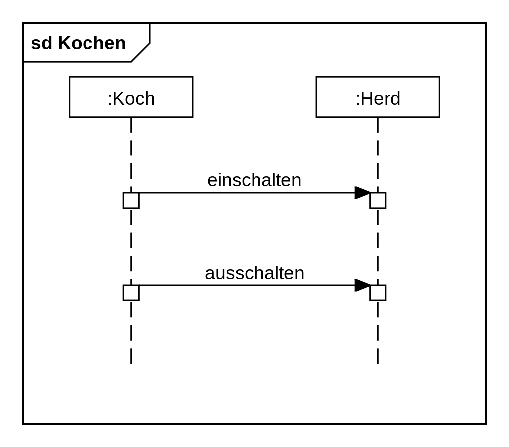

In diesem Beispiel sehen wir ein einfaches Sequenzdiagramm, dass einen Koch zeigt, der den Herd ein- und ausschalten kann.

Links oben im Kopfbereich steht der Diagrammname. Bei Sequenzdiagrammen wird das Schlüsselwort sd oder interaction vorangestellt.

Die Kommunikationspartner werden als beschriftete Rechtecke dargestellt. Von jedem geht eine gestrichelte Linie abwärts, sie stellt die Lebenslinie dar.

Zwischen den Lebenslinien befinden sich die synchronen Operationsaufrufe (Nachrichten).
Der Name der Nachricht befindet

1. Der Koch schaltet den Herd ein.
2. Erst nachdem dies getan wurde, kann der Koch den Herd wieder ausschalten.


## Zustandsdiagramm
### Einsatzzweck
Zustandsdiagramme, auch bekannt als Zustandsmaschinen, sind eine Art von Verhaltensdiagramm in der Unified Modeling Language (UML). Sie werden verwendet, um das Verhalten eines Objekts oder Systems in Bezug auf seine Zustände und Übergänge zwischen diesen Zuständen darzustellen. Zustandsdiagramme haben mehrere Einsatzzwecke:

- Modellierung von Zustandsabhängigem Verhalten:
Zustandsdiagramme ermöglichen die Modellierung des zustandsabhängigen Verhaltens von Objekten oder Systemen. Sie zeigen, wie sich ein Objekt oder System aufgrund von Ereignissen oder Bedingungen von einem Zustand in einen anderen Zustand bewegt. Dies ist nützlich, um das dynamische Verhalten und die Lebenszyklen von Objekten oder Systemen besser zu verstehen.

- Analyse und Design von Systemen:
Zustandsdiagramme können bei der Analyse und dem Design von Systemen eingesetzt werden. Sie ermöglichen es, die verschiedenen Zustände und Übergänge, die ein System durchlaufen kann, sowie die Ereignisse oder Bedingungen, die diese Übergänge auslösen, zu identifizieren und zu organisieren. Dies hilft bei der Planung und Strukturierung der Systemarchitektur und der Implementierung von zustandsabhängigen Funktionen.

- Veranschaulichung von Anwendungsfällen und Szenarien:
Zustandsdiagramme können verwendet werden, um Anwendungsfälle und Szenarien in einem System zu veranschaulichen. Sie zeigen, wie ein Objekt oder System seinen Zustand aufgrund von Ereignissen oder Bedingungen ändert, um bestimmte Anforderungen und Funktionen des Systems zu erfüllen. Dies hilft Entwicklern und Stakeholdern, die Funktionsweise und den Ablauf von Anwendungsfällen besser zu verstehen.

- Kommunikation und Zusammenarbeit:
Zustandsdiagramme dienen als gemeinsame visuelle Sprache für Teammitglieder, Stakeholder und Kunden. Sie erleichtern die Kommunikation über das zustandsabhängige Verhalten von Objekten oder Systemen und fördern die Zusammenarbeit bei der Planung, Entwicklung und Wartung von Softwareprojekten.

- Dokumentation:
Zustandsdiagramme sind ein effektives Mittel zur Dokumentation von Softwaresystemen. Sie bieten eine strukturierte und leicht verständliche Darstellung der Zustände, Übergänge, Ereignisse und Bedingungen, die im System implementiert sind. Diese Dokumentation ist nützlich für das Verständnis, die Wartung und die Erweiterung des Systems im Laufe der Zeit.

- Validierung und Verifizierung:
Zustandsdiagramme können zur Validierung und Verifizierung von Systemanforderungen und -funktionen verwendet werden. Sie ermöglichen die Überprüfung, ob das geplante zustandsabhängige Verhalten den Anforderungen entspricht und ob es konsistent und logisch ist.

Insgesamt sind Zustandsdiagramme ein wertvolles Werkzeug für die Planung, Analyse, Kommunikation und Dokumentation von Softwaresystemen. Sie tragen dazu bei, ein klareres Verständnis des zustandsabhängigen Verhaltens von Objekten oder Systemen zu erlangen und die Qualität


### Wesentliche Notationsformen
Zustandsdiagramme in der Unified Modeling Language (UML) verwenden mehrere Notationsformen, um Zustände, Übergänge und andere Aspekte des zustandsabhängigen Verhaltens darzustellen.

Zustände: Ein Zustand wird in einem Zustandsdiagramm durch einen Kreis oder eine Ellipse dargestellt. Der Name des Zustands wird im Kreis oder der Ellipse angegeben.

- Übergänge: Ein Übergang beschreibt den Wechsel eines Systems von einem Zustand in einen anderen. Ein Übergang wird durch eine Pfeillinie dargestellt, die den Zustand, aus dem das System herausgeht, mit dem Zustand verbindet, in den es eintritt. Der Übergang kann auch mit einer Bedingung oder Aktion versehen werden, die angeben, wann der Übergang stattfindet und welche Aktionen während des Übergangs ausgeführt werden sollen.

- Startzustand: Ein Startzustand wird durch einen Kreis mit einem Pfeil dargestellt, der auf den ersten Zustand zeigt. Er zeigt an, in welchem Zustand das System beim Start des Zustandsdiagramms ist.

- Endzustand: Ein Endzustand wird durch einen doppelten Kreis dargestellt. Er zeigt an, dass das System in diesem Zustand beendet wird.

- Historienzustand: Ein Historienzustand wird durch einen Kreis mit einem H dargestellt. Er zeigt an, dass das System in den zuletzt besuchten Zustand zurückkehren wird.

- Vertikale Gruppierung: Zustandsdiagramme können durch horizontale oder vertikale Gruppierung in Teile gegliedert werden. Diese Gruppierungen helfen dabei, komplexe Zustandsdiagramme übersichtlicher darzustellen.


### Exemplarische Anwendung Beispiel


In diesem einfachen Beispiele, sehen wir ein Zustandsdiagramm für Klausuren.

Es wird links oben gestartet, beim Startzustand (Pseudozustand) und dann wird die erste Aktion Punkte addieren ausgeführt. Nach diesem Schritt, treffen wir auf einen Entscheidungsknoten.
Ist die Klausur schlecht ausgefallen, kommen wir zur nächsten Aktion Klausur nicht bestanden und springen direkt zum Endzustand.

Falls die Klausur mit >= 100 Punkten abgeschlossen wurde, kommen wir zur Aktion Klausur bestanden und im Anschluss zur Aktion Note ermittelt. Dies führt zu einer Gabelung, wobei die Note veröffentlicht und der Studienschein ausgestellt wird. Schließlich kommt es wieder zur Vereinigung und dann zum Endzustand.

#
#
# Textuelles Diagramm Design-Tool

## PlantUML

## Mermaid


#
#
# USE-CASE-DIAGRAMM 1
Interpretieren Sie schriftlich das folgende Use-Case-Diagramm:
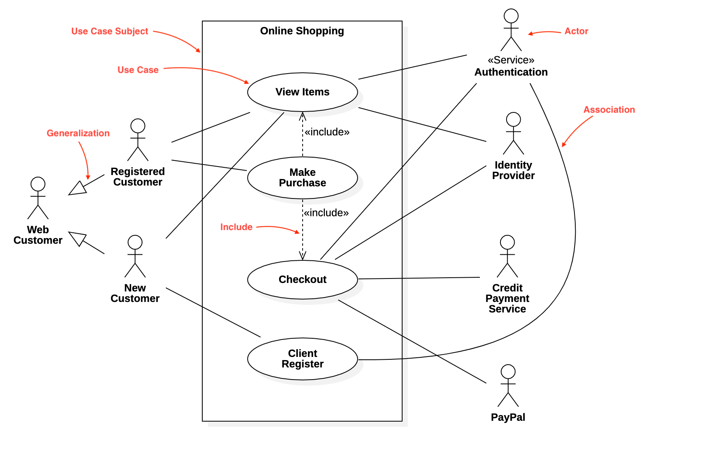

In diesem Beispiel sehen wir ein Use-Case Diagramm für einen Online Shop. Der rechteckige Rahmen stellt unser System dar und grenzt den Kontext ab. Die Akteure befinden sich außerhalb des Systems und sind als Strichmännchen dargestellt. Akteure können konkrete Personen sein, aber auch abstrakte Elemente wie z.B. einen Service darstellen. Anweundungsfälle (Use-Cases) werden als Ellipse visualisiert. Zwischen den Akteuren und Anwendungsfällen bestehen unterschiedliche Beziehungen.

Auf der linken Seite sehen wir die Kunden, wobei hier der "Web Customer" als Mutterklasse fungiert.
Ein "Web Costumer" kann somit ein "Registered Customer", oder ein "New Customer" sein.

Im Falle dass es sich um einen "New Customer" handelt, kann er sich lediglich über "View Items" Waren ansehn und sich über "Client Register" registrieren.

Wenn es sich um einen "Registered Customer" kann sich dieser ebenfalls über "View Items" Waren anshen und zusätzlich über "Make Purchase" einen Kauf durchführen. "Make Purchase" inkludiert "View Items" und "Checkout", da kein Kauf Zustande kommt, wenn zuvor keine Waren hinzugefügt wurden und die Waren nicht bezahlt werden.

Auf der rechten Seite sehen wir den Akteur "(Service) Authentication". Nachdem sich ein Neukunde registriert und authentifiziert kann er sich ebenfalls Waren ansehen und auschecken.
"Identity Provider" steht in Beziehung mit "View Items" und "Checkout".
Der Use-Case "Checkout" hat auch noch Beziehungen zu den restlichen 2 Akteuren, "Credit Payment Service" und "PayPal".

#
#
# USE-CASE-DIAGRAMM 2
Interpretieren Sie schriftlich das folgende Use-Case-Diagramm:


In diesem Beispiel eines Use-Case Diagramms sehen wir ein System, dass es registrierten Kunden ermöglicht Essen zu bestellen und bei Wunsch Online, mit verschiedenen Zahloptionen, zu bezahlen.

Der Akteur "Hungriger Kunde" verwendet den Use-Case "Als Kunde registrieren" um sich zu registrieren. Nachdem erfolreichem registrieren, kann dieser den Anwendungsfall "Essen bestellen" verwenden. "Essen bestellen" hat eine include Beziehung zu "Bestellbestätigung senden", dies bedeutet dass zu jeder Bestellung eine Bestellbestätigung gesendet werden muss. Der Use-Case "Bestellbestätigung senden" kommuniziert mit dem Akteur "E-Mail-System" um diese zu versenden.

Der Use-Case "Essen bestellen" hat ebenso eine extend Beziehung zu dem Use-Case "Online bezahlen". Das bedeutet, dass für den Kunden die Möglichkeit besteht online zu bezahlen, dies ist jedoch nicht verpflichtend. "Online bezahlen" fungiert als Mutterklasse für die Anwendungsfälle "Mit Kreditkarte bezahlen" und "Mit EC Karte bezahlen". Falls der Kunde dann online bezahlt, kommunizert der Use-Case "Online bezahlen" mit dem Akteur "Bezahlsystem" um die Bezahlung abzuschließen.

#
#
# USE-CASE-DIAGRAMM 3
Entwerfen Sie ein Anwendungsfalldiagramm zu der folgenden Beschreibung:

In einem Kino kann ein Gast Kinokarten an der Kasse kaufen, die vorbestellt sein könnten. Außerdem ist es
möglich Popcorn und Getränke zu bestellen. Danach bezahlt der Kunde beim Kassierer die Rechnung. Es ist
auch möglich mit Kreditkarte zu bezahlen, welche bei Bedarf einer automatischen Prüfung unterzogen werden
kann.

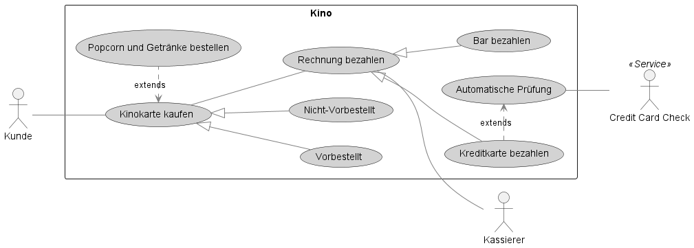

#
#
# USE-CASE-DIAGRAMM 4
Entwerfen Sie ein Anwendungsfalldiagramm zu der folgenden Beschreibung:
Es soll ein Anwendungssystem zur Unterstützung der Geschäftsprozesse in einem Krankenhaus
entwickelt werden. Das System soll folgende Aufgaben erledigen:
- Herr Müller und Herr Maier seien in der Verwaltung angestellt.
- Herr Müller soll Mitarbeiter einstellen und entlassen können. Sowohl Herr Müller als auch Herr Maier
kann Patienten aufnehmen und entlassen.
- Sowohl bei der Einstellung von Mitarbeitern, als auch bei der Aufnahme von Patienten müssen Name
und Adresse erfasst werden. Um redundante Anwendungsfall-Beschreibungen zu verhindern wird
diese Tätigkeit in einen gesonderten Anwendungsfall ausgelagert.
- Falls der einzustellende Mitarbeiter bzw. der aufzunehmende Patient seinen Wohnsitz am Ort des
Krankenhauses hat, wird geprüft, ob die angegebene Adresse am Wohnort existiert. Lagern Sie auch
diesen Anwendungsfall aus.


#
#
# USE-CASE-DETAILBESCHREIBUNGEN
Definieren Sie die Use-Case-Details (level, complexity, status, pre-conditions, post-conditions and assumptions,
event flow etc.) für einige Use-Cases der vorhergehenden Use-Case-Übungen. Verwenden Sie dazu eine der
bereitgestellten Schablonen bzw. ein entsprechendes Software-Tool.

Schablone A
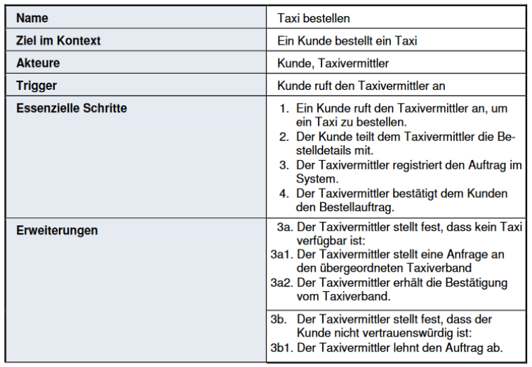
Schablone B
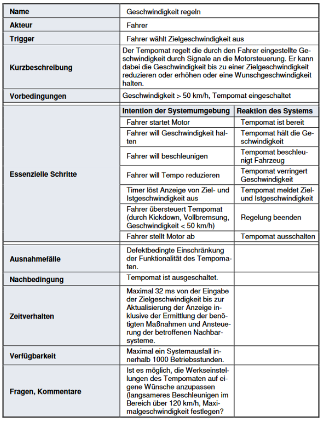


Use-Case Detailbeschreibung lt. Schablone A (Auszug aus Use-Case Diagramm 2)
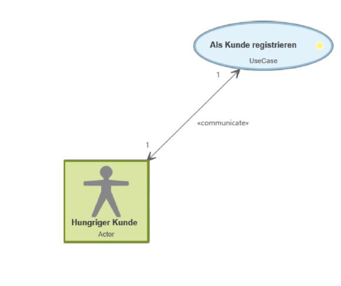

<table class="tg">
<tbody>
  <tr>
    <td class="tg-0pky">Name</td>
    <td class="tg-0pky">Als Kunde registrieren</td>
  </tr>
  <tr>
    <td class="tg-0pky">Ziel im Kontext</td>
    <td class="tg-0pky">Ein hungriger Kunde registriert sich über die Lieferketten-App</td>
  </tr>
  <tr>
    <td class="tg-0pky">Akteure</td>
    <td class="tg-0pky">Hungriger Kunde</td>
  </tr>
  <tr>
    <td class="tg-0pky">Trigger</td>
    <td class="tg-0pky">Hungriger Kunde möchte bei der Lieferkette Essen bestellen</td>
  </tr>
  <tr>
    <td class="tg-0pky">Essenzielle Schritte</td>
    <td class="tg-0pky">
      1. Der Kunde öffnet die App der Lieferkette auf seinem Handy. <br>
      2. Der Kunde wählt die Option "Registrieren" aus. <br>
      3. Der Kunde gibt seine korrekten Daten an und schickt diese ab.<br>
      4. Der Kunde üprüft sein E-Mail Postfach und schließt die Registrierung über einen link ab.
    </td>
  </tr>
  <tr>
    <td rowspan=2 class="tg-0pky">Erweiterungen</td>
    <td class="tg-0pky">
      1.1. Auf Seiten der Lieferkette gibt es technische Probleme. <br>
      1.2. Der Kunde kann die App nicht verwenden. <br>
      1.3. Der Kunde kann sich nicht registrieren. <br>
      1.4. Der Kunde schließt die App. 
    </td>
  </tr>
  <tr>
  <td class="tg-0pky">
      3.1. Die angegebenen Daten waren nicht korrekt. <br>
      3.2. Der Kunde wird aufgefordert die Fehler zu beheben. <br>
      3.3. Die Bestellung wird von Seiten des Lieferanten storniert. 
    </td>
  </tr>
</tbody>
</table>


Use-Case Detailbeschreibung lt. Schablone A (Auszug aus Use-Case Diagramm 2)
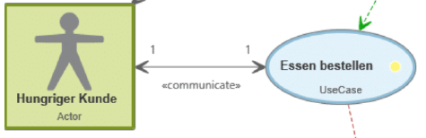

<table class="tg">
<tbody>
  <tr>
    <td class="tg-0pky">Name</td>
    <td class="tg-0pky">Essen bestellen</td>
  </tr>
  <tr>
    <td class="tg-0pky">Ziel im Kontext</td>
    <td class="tg-0pky">Ein hungriger Kunde bestellt essen</td>
  </tr>
  <tr>
    <td class="tg-0pky">Akteure</td>
    <td class="tg-0pky">Hungriger Kunde</td>
  </tr>
  <tr>
    <td class="tg-0pky">Trigger</td>
    <td class="tg-0pky">Hungriger Kunde öffnet die App der Lieferkette</td>
  </tr>
  <tr>
    <td class="tg-0pky">Essenzielle Schritte</td>
    <td class="tg-0pky">
      1. Der Kunde öffnet die App der Lieferkette auf seinem Handy. <br>
      2. Der Kunde durchsucht die App nach Gerichten/Getränken. <br>
      3. Der Kunde wählt ein oder mehrere Gerichte/Getränke seiner Wahl aus und fügt diese dem Warenkorb hinzu.<br>
      4. Der Kunde schickt die Bestellung ab.
    </td>
  </tr>
  <tr>
    <td rowspan=2 class="tg-0pky">Erweiterungen</td>
    <td class="tg-0pky">
      1.1. Auf Seiten der Lieferkette gibt es technische Probleme. <br>
      1.2. Der Kunde kann die App durchsuchen. <br>
      1.3. Aufgrund der technischen Probleme kann der Kunde nichts in seinen Warenkorb legen. <br>
      1.4. Der Kunde schließt die App. 
    </td>
  </tr>
</tbody>
</table>


#
#
# KLASSENDIAGRAMME 1
Gegeben ist folgendes Klassendiagramm:
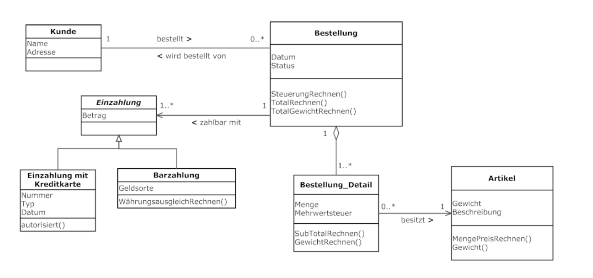

Bestimmen Sie, ob die folgenden Aussagen zum Klassendiagramm richtig oder falsch sind.
- [x]	Es kann im System Kunden geben die nie eine Bestellung durchgeführt haben.
- [ ]	Die Klasse Einzahlung ist die Oberklasse der Klasse Bestellung.
- [x]	Jedes Objekt der Klasse Bestellung_Detail besitzt genau einen Artikel.
- [x]	Alle Einzahlungen mit Kreditkarte haben einen Betrag.
- [x]	Es ist möglich, dass ein Artikel keine Assoziation mit einem Bestellung_Detail besitzt.
- [ ]	Jedes Bestellung_Detail, das Teil einer Bestellung ist, hat seinen eigenen Status und sein eigenes Datum.

#
#
# KLASSENDIAGRAMME 2
Gegeben ist der folgende Sachverhalt.
> Jede Person hat einen Namen, eine Telefonnummer und E-Mail. Jede Wohnadresse wird von nur einer
Person bewohnt. Es kann aber sein, dass einige Wohnadressen nichtbewohnt sind. Den Wohnadressen sind
je eine Strasse, eine Stadt, eine PLZ und ein Land zugeteilt. Alle Wohnadressen können bestätigt werden
und als Beschriftung (für Postversand) gedruckt werden. Es gibt zwei Sorten von Personen: Student, welcher
sich für ein Modul einschreiben kann und Professor, welcher einen Lohn hat. Der Student besitzt eine
Matrikelnummer und eine Durchschnittsnote.

Modellieren Sie diesen Sachverhalt mit einem UML Klassendiagramm.


#
#
# KLASSENDIAGRAMME 3
Sie haben den Auftrag, eine Online-Videothek zu realisieren. Sie haben dazu folgende Angaben erhalten:
- Die Videothek unterstützt das Ausleihen von Filmen für registrierte Kunden. Dazu müssen
- Kunden sich zunächst mit ihrer Kundennummer und ihrem Passwort anmelden.
- Kunden werden zusammen mit ihrem Guthaben verwaltet.
- Filme besitzen einen individuellen Namen und Preis.
- Ein Film wird über einen Streaming-Server bereitgestellt. Der Server kann hierzu einen
kundenspezifischen Link generieren.

Modellieren Sie diesen Sachverhalt anhand eines Klassendiagramms. Wählen Sie sinnvolle Operationen (mit
möglichst vollständigen Signaturen) und Attribute für Ihre Klassen. Ergänzen Sie die Klassen um sinnvolle
Beziehungen und deren Kardinalitäten.


#
#
# KLASSENDIAGRAMME 4
Interpretieren Sie schriftlich das folgende Klassendiagramm:
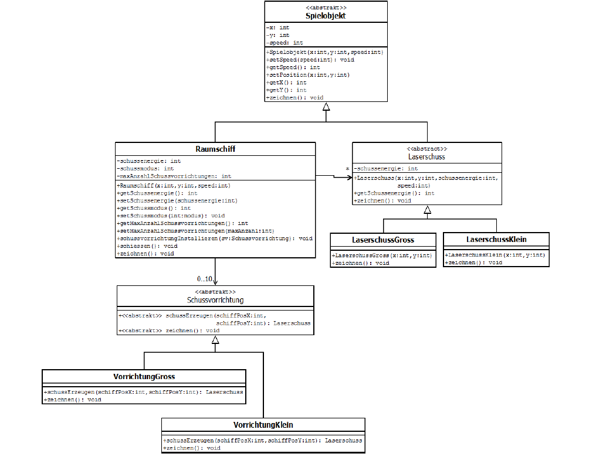

Das Beispiel zeigt ein Klassendiagramm für ein Spiel mit verschiedenen Klassen, die Raumschiffe, Laserschüsse und Schussvorrichtungen beschreiben.

Es gibt eine abstrakte Klasse "Spielobjekt", das Eigenschaften wie x- und y-Koordinaten und Geschwindigkeit enthält. Die Klasse "Raumschiff" ist eine spezialisierte Form von Spielobjekt und hat zusätzliche Eigenschaften wie Schussenergie, Schussmodus und maximale Anzahl an Schussvorrichtungen. Raumschiffe können mehrere Laserschüsse abfeuern, die durch die abstrakte Klasse "Laserschuss" repräsentiert werden. Es gibt auch zwei spezialisierte Klassen von Laserschüssen, "LaserschussGroß" und "LaserschussKlein".

Die abstrakte Klasse "Schussvorrichtung" enthält eine abstrakte Methode "schussErzeugen", die von den spezialisierten Schussvorrichtungen "VorrichtungGroß" und "VorrichtungKlein" implementiert wird. Die Mulitpilizität gibt an, das Raumschiffe zwischen 0 und 10 Schussvorrichtungen haben können.

Das Diagramm enthält auch Methoden für das Zeichnen von Spielobjekten und Laserschüssen. Die Pfeile zwischen den Klassen zeigen die Beziehungen zwischen ihnen an, wie Vererbung und Assoziation.

#
#
# SEQUENZDIAGRAMM 1
Interpretieren Sie schriftlich das folgende Sequenzdiagramm:


Dieses Beispiel eines Sequenzdiagramm zeigt den Ablauf des Kommentare-Submit-Vorgangs in einer Webanwendung.

Zunächst ruft der Benutzer die validate()-Funktion auf, um seine eingegebenen Kommentare zu validieren. Diese Funktion wird auf dem Client ausgeführt und aktiviert die Validierungsfunktion in der Kommentarklasse.

Nachdem die Validierung abgeschlossen ist, wird ein Ajax-Request an den Server gesendet, um die Validierungsergebnisse abzurufen. Dieser Request wird von einem Proxy-Objekt gesendet, das vom Client erstellt wurde.

Auf dem Server empfängt der DWRServlet den Ajax-Request und leitet ihn an den DWRService weiter. Der DWRService führt die Validierung durch und gibt die Ergebnisse an den DWRServlet zurück.

Das DWRServlet sendet dann die Validierungsergebnisse an das Proxy-Objekt. Sobald das Proxy-Objekt die Ergebnisse empfangen hat, ruft es die Callback-Funktion auf, die in diesem Fall die post_comments()-Funktion aufruft.

In dieser Funktion wird ein weiterer Ajax-Request gesendet, um die Kommentare an den Server zu senden. Der Request wird von einem PluckRequestBatch-Objekt erstellt.

Nachdem der Request gesendet wurde, ruft das PluckService-Objekt auf dem Server die postComments()-Funktion auf, um die Kommentare zu verarbeiten. Sobald die Verarbeitung abgeschlossen ist, gibt der PluckService die Ergebnisse als JSON an das Proxy-Objekt zurück.

Das Proxy-Objekt ruft dann die Callback-Funktion auf, die in diesem Fall die Handle errors from Pluck()-Funktion aufruft, falls es Fehler gibt, oder die Request all comments()-Funktion aufruft, um alle Kommentare vom Server abzurufen, falls alles erfolgreich war.

#
#
# SEQUENZDIAGRAMM 2
Modellieren Sie für die Online-Videothek (siehe Aufgabe 3) die Film Ausleihen Funktion. Erstellen Sie dazu ein
Sequenzdiagramm für folgenden Ablauf der Ausleihe:
• Die Videothek berechnet zuerst, ob das Guthaben des Kunden reicht um den Film zu bezahlen.
• Reicht das Guthaben nicht aus, wird stattdessen eine Aufforderung zum Ausfüllen des Guthabens
angezeigt.
• Falls das aktuelle Guthaben des Mitglieds ausreicht, veranlasst die Videothek einen Streaming-
Server einen Link für den Film zu generieren.
• Die Videothek zeigt dem Benutzer den Link an, unter dem der Film zugreifbar ist.
Gehen Sie davon aus, dass sich das Mitglied bereits auf der Seite des gewünschten Films beendet.


#
#
# AKITIVITÄTSDIAGRAMM 1
Interpretieren Sie schriftlich das folgende Aktivitätsdiagramm:
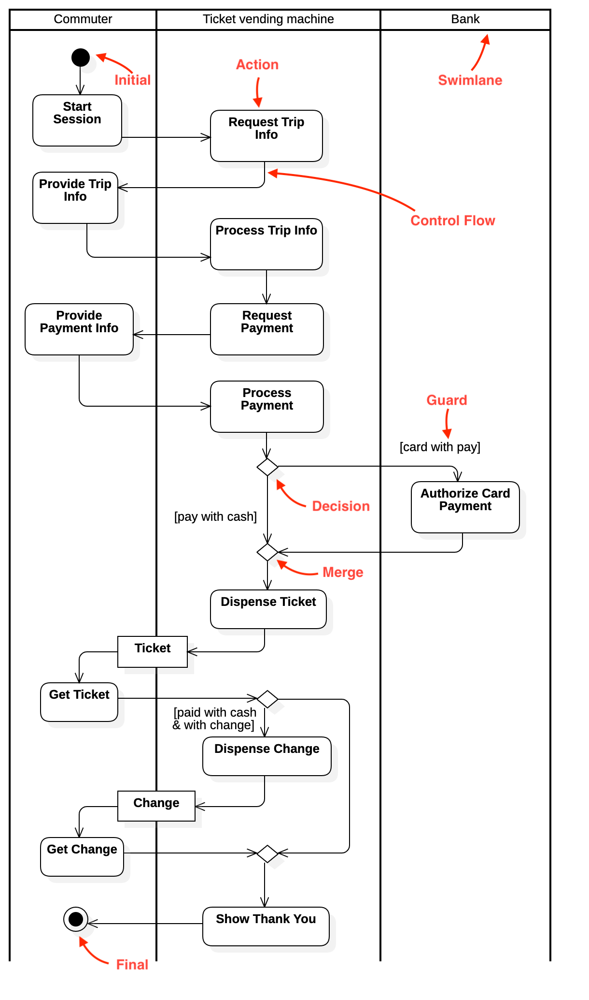

Dieses Beispiel eines Aktivitätsdiagramms zeigt den Ablauf von einem Pendler, der einen Ticketautomaten benutzt.

Es sind dabei 3 Akteure beteiligt:
- Commuter
- Ticket Vending Machine
- Bank

Wir starten beim Initalknoten und der Pendler beginnt mit "Start Session" und fordert beim Ticketautomaten "Request Trip Info" eine Reiseinfo an. Diese werdem dem Pendeler dann über "Provide Trip Info" angezeigt. Dieser wählt nun sein gewünschtes Reiseziel und der Ticketautomat verarbeitet diese Anfrage dann "Process Trip Info". Nach diesem Schritt, verlangt der Ticketautomat nach einer Zahlung "Request Payment". Der Pendler gibt seine Zahlungsdaten bekannt "Provide Payment Info" und diese Daten werden dann vom Automaten verarbeitet "Process Payment".

Hier stoßen wir auf eine Verzweigung, wobei der Pendler sich zwischen Bar- und Kartenzahlung entscheiden muss. Bei der Barzahlung wird das Geld vom Automaten entgegengenommen, wohingegegen bei der Kartenzahlung noch autorisiert wird "Authorize Card Payment". Die Flusslinien laufen dann wieder zusammen und der Ticketautomat bereitet das Ticket vor und druckt dieses aus "Ticket".

Der Pendler kann sich dann das Ticket aus dem Automaten nehmen "Get Ticket". Nun stoßen wir auf die nächste Verzweigung. Hat der Pendler zuvor passend bar oder mit Karte bezahlt hat, ist der Kauf abgeschlossen und es wird eine "Show Thank you" Mitteilung angezeigt.

Falls er jedoch bar bezahlt hat und noch Wechselgeld zurückbekommt, wird dies über "Dispense Change" vom Automaten realisert. Der Automat gibt dann das fehlende Restgeld "Change" zurück. Der Pendler kann sich das Wechselgelnd nehmen "Get Change" und die Flusslinien laufen dann wieder zusammen und es wir die "Show Thank you" Mitteilung angezeigt.

#
#
# AKITIVITÄTSDIAGRAMM 2
Modellieren Sie schriftlich den folgenden Sachverhalt als Aktivitätsdiagramm:
> Ein Fluggast ist am Flughafen angekommen. Zur Überprüfung seines Tickets begibt er sich zum
Schalterseiner Fluggesellschaft. Falls das Ticket in Ordnung ist, übergibt er am Schalter sein Gepäck. Falls
mit dem Ticket etwas nicht stimmt, muss der Fluggast den Kundendienst konsultieren und er kann
nichtmitfliegen. Das Gepäck wird zudem auf Übergewicht überprüft. Falls dem so ist, muss der Fluggast
zusätzliche Kostenübernehmen. Falls aber das Gewicht in Ordnung ist, wird die Bordkarte ausgestellt.


#
#
# ZUSTANDSDIAGRAMM 1
Interpretieren Sie schriftlich das folgende Zustandsdiagramm:
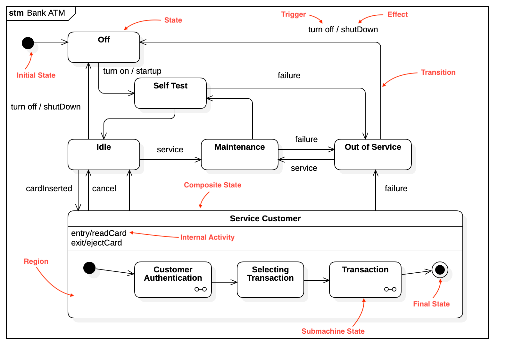

Das folgende Beispiel ist ein UML-Zustandsdiagramm, das den Zustandsübergang eines Bankautomaten beschreibt. Das Diagramm zeigt die verschiedenen Zustände des Automaten sowie die Übergänge zwischen ihnen an.

Das Diagramm beginnt mit dem Startzustand "Off". Wenn der Automat eingeschaltet wird, geht er in den Zustand "SelfTest" über, wo eine Selbstprüfung durchgeführt wird. Wenn die Selbstprüfung erfolgreich ist, geht der Automat in den Zustand "Idle" über, wo er darauf wartet, dass eine Karte eingeführt wird.

Wenn eine Karte eingeführt wird, geht der Automat in den Zustand "ServiceCustomer" über, wo der Kunde authentifiziert wird. Wenn die Authentifizierung erfolgreich ist, geht der Automat in den Zustand "SelectingTransaction" über, wo der Kunde auswählen kann, welche Transaktion er durchführen möchte.

Wenn der Kunde eine Transaktion auswählt, geht der Automat in den Zustand "Transaction" über und führt die ausgewählte Transaktion durch. Wenn die Transaktion abgeschlossen ist, geht der Automat wieder in den Zustand "Idle" zurück und wartet auf die nächste Karte.

Wenn es zu einem Fehler kommt, geht der Automat in den Zustand "OutOfService" über, wo er nicht mehr verwendet werden kann, bis er repariert wurde. Der Automat kann auch in den Zustand "Maintenance" gehen, wo er gewartet oder repariert wird. Wenn die Wartung abgeschlossen ist, geht der Automat wieder in den Zustand "Idle" zurück. Wenn der Automat ausgeschaltet wird, geht er wieder in den Zustand "Off" zurück.


#
#
# ZUSTANDSDIAGRAMM 2
Entwerfen Sie ein Zustandsdiagramm für eine Bestellung auf Amazon. Modellieren Sie dazu die Zustände und
die Übergänge einer Bestellung vom Aufgeben der Bestellung bis hin zur Aushändigung des Paketes an den
Kunden.


#
#
# C4-DIAGRAMM
Arbeite dich in das C4-Modell zur Visualisierung von Architekturen von Softwaresystemen ein.
https://c4model.com
Dokumentieren Sie danach die Architektur deines Spring-Boot-Abschlussprojektes aus dem Unterricht mit dem
C4-Diagrammmodell:
- Level 1: System Context diagram
- Level 2: Container diagramm
- Level 3: Component diagramm
- Level 4: Klassendiagramm (Beispielhaft nur für ein paar Komponenten aus Level 3)

## C4-Model
Die folgenden C4-Diagramme beschreiben die verschiedenen Schichten des Systems
’GrowManager’. Diese werden in den einzelnen Diagrammen genauer aufgezeigt. Bei
diesem Model wird das System in Container und Komponenten aufgeteilt - jedes der
Diagramme zeigt dabei eine andere Detailansicht. Ein C4-Modell wird in Context-
, Container-, Component- und Code-Diagramm unterteilt. Dabei abstrahiert das
nächstfolgende Diagramm jeweils einen Teil des vorhergegangenen Diagramms.

### C4-Context Diagramm
Zunnächst wird das C4-Context Diagramm beschrieben:
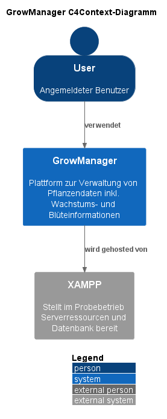

Im Diagramm gibt es drei Hauptelemente:
- User (Angemeldeter Benutzer): Dies repräsentiert die Person, die das GrowManager-
System verwendet. Die Rolle des Benutzers ist es, mit dem System zu interagieren
und dessen Funktionen zu nutzen.
- GrowManager (System): Dies ist das Hauptsystem, das im Diagramm dargestellt
wird. Der GrowManager ist eine Plattform zur Verwaltung von Pflanzendaten,
einschließlich Wachstums- und Blüte-Informationen. Das System ist
dafür verantwortlich, Benutzern die Möglichkeit zu geben, auf diese Daten
zuzugreifen und sie zu verwalten.
- XAMPP (System-Ext): XAMPP ist ein externes System, das im Probebetrieb
Serverressourcen und eine Datenbank für den GrowManager bereitstellt. Es
dient als Hosting-Infrastruktur für das GrowManager-System.

Die Beziehungen zwischen diesen Elementen sind wie folgt dargestellt:
- Der Benutzer (User) ’verwendet’ das GrowManager-System, was bedeutet,
dass der Benutzer auf das System zugreift und dessen Funktionen nutzt.
- Das GrowManager-System ’wird gehosted von’ XAMPP, was darauf hinweist,
dass XAMPP als Hosting-Plattform für das GrowManager-System dient.


### C4-Container Diagramm
Nun wird das C4-Container Diagramm dargestellt:
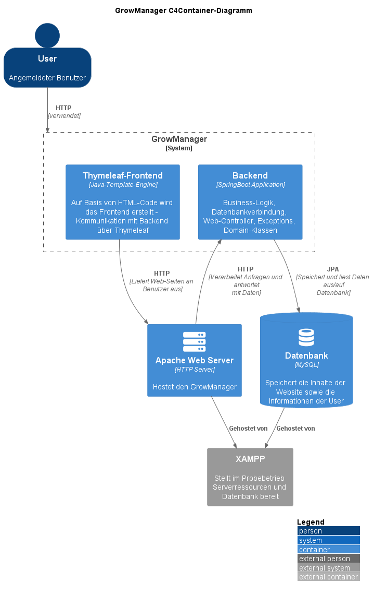


In der nächsten Abbildung sind fünf Hauptelemente innerhalb der Systemgrenze des GrowManagers zu sehen:
- Backend: Dies ist eine Spring Boot-Anwendung, die für die Business-Logik,
Datenbankverbindung, Web-Controller, Exceptions und Domain-Klassen verantwortlich
ist.
- Thymeleaf-Frontend: Dies ist eine Java-Template-Engine, die auf HTML-Code
basiert und für die Erstellung des Frontends verantwortlich ist. Das Frontend
kommuniziert mit dem Backend über Thymeleaf.
- Apache Web Server: Dies ist ein HTTP-Server, der den GrowManager hostet.
- Datenbank: Dies ist eine MySQL-Datenbank, die die Inhalte derWebsite sowie
die Informationen der Benutzer speichert.
- XAMPP: Dies ist ein externes System, das im Probebetrieb Serverressourcen
und Datenbank bereitstellt.
- Es gibt auch den angemeldeten Benutzer (User) im Diagramm, der das GrowManager-
System verwendet.

Die Beziehungen zwischen diesen Elementen sind wie folgt dargestellt:
- Der Thymeleaf-Frontend-Container liefert Web-Seiten an den Benutzer über
den Apache Web Server-Container mit HTTP.
- Der Apache Web Server-Container verarbeitet Anfragen und antwortet mit
Daten an das Backend über HTTP.
- Das Backend kommuniziert mit der Datenbank über JPA, um Daten zu speichern
und aus der Datenbank zu lesen.
- Sowohl der Apache Web Server als auch die Datenbank werden von XAMPP
gehostet.
- Der Benutzer (User) verwendet das GrowManager-System über HTTP.


### C4-Component Diagramm
Das C4-Component Diagramm wird in zwei Diagramme aufgeteilt, da es einfacher
ist, das Frontend und das Backend separat aufzuzeigen.

Zunächst wird das Diagramm
für das Backend beschrieben:
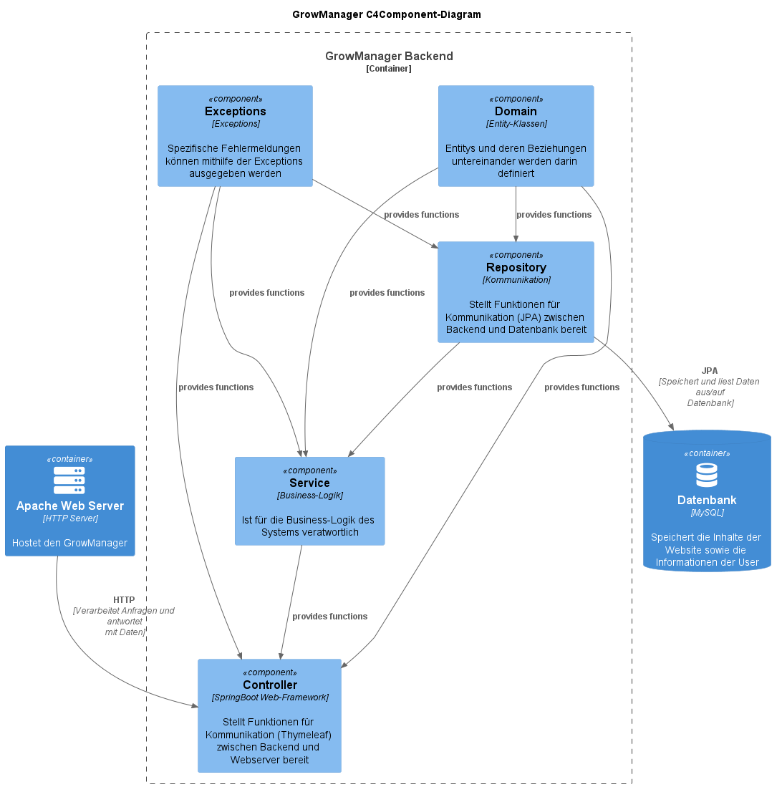

Im Diagramm gibt es fünf Hauptkomponenten innerhalb der Containergrenze des
GrowManager-Backends:
- Controller: Eine Komponente, die das Spring Boot Web-Framework verwendet
und Funktionen für die Kommunikation (Thymeleaf) zwischen Backend und
Webserver bereitstellt.
- Repository: Eine Komponente, die für die Kommunikation (JPA) zwischen
Backend und Datenbank verantwortlich ist und entsprechende Funktionen bereitstellt.
- Service: Eine Komponente, die für die Business-Logik des Systems verantwortlich
ist.
- Domain: Eine Komponente, die Entity-Klassen und deren Beziehungen untereinander
definiert.
- Exceptions: Eine Komponente, die spezifische Fehlermeldungen mithilfe von
Exceptions ausgibt.

Zusätzlich gibt es zwei weitere Container im Diagramm, die nicht innerhalb der
GrowManager-Backend-Grenze liegen:
- Apache Web Server: Ein HTTP-Server, der den GrowManager hostet.
- Datenbank: Eine MySQL-Datenbank, die die Inhalte der Website sowie die
Informationen der Benutzer speichert.

Die Beziehungen zwischen den Komponenten und Containern sind wie folgt dargestellt:
- Die Domain-Komponente stellt Funktionen für das Repository, den Service
und den Controller bereit.
- Die Exceptions-Komponente stellt Funktionen für das Repository, den Service
und den Controller bereit.
- Das Repository stellt Funktionen für den Service bereit.
- Der Service stellt Funktionen für den Controller bereit.
- Das Repository kommuniziert mit der Datenbank über JPA, um Daten zu
speichern und aus der Datenbank zu lesen.
- Der Controller verarbeitet Anfragen und antwortet mit Daten an den Apache
Web Server über HTTP.

Nun wird das C4-Component Diagramm für das Frontend aufgezeigt:
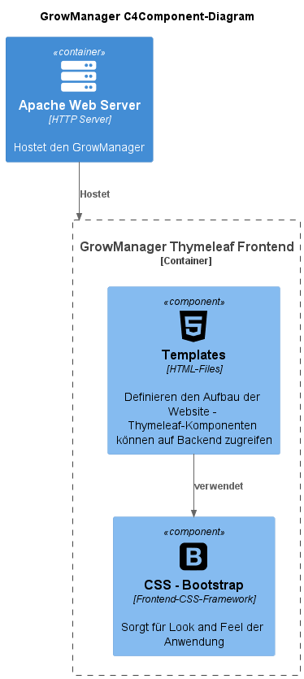

Es gibt zwei Hauptkomponenten innerhalb der Containergrenze des GrowManager-Thymeleaf-
Frontends:
- Templates: Eine Komponente, die HTML-Dateien enthält, welche den Aufbau
der Website definieren. Thymeleaf-Komponenten in den Templates können auf
das Backend zugreifen.
- CSS - Bootstrap: Eine Komponente, die ein Frontend-CSS-Framework repräsentiert
und für das Look-and-Feel der Anwendung sorgt.

Wieder gibt es einen weiteren Container im Diagramm, der nicht innerhalb der
GrowManager-Thymeleaf-Frontend-Grenze liegt:
- Apache Web Server: Ein HTTP-Server, der den GrowManager hostet.

Die Beziehungen zwischen den Komponenten und Containern sind wie folgt dargestellt:
- Die Templates-Komponente verwendet die CSS-Bootstrap-Komponente, um
das Aussehen der Website zu gestalten.
- Der Apache Web Server hostet das GrowManager-Thymeleaf-Frontend.


### C4-Code Diagramm
Da es im System sehr viele relevante Codeausschnitte gibt, wird zunächst ein Teil
des Backends näher beschrieben. Dazu wurde ein Klassendiagramm aller relevanten
Klassen für die Tabelle ’Grow’ erstellt:

Das nachfolgende Diagramm zeigt einen Teil der Architektur und Klassenstruktur
des GrowManager-Projekts.


Die Hauptkomponenten des Projekts sind in
vier Paketen organisiert: domain, repository, service und controller.
- com.growmanager.domain:
  - Plant: Eine Klasse, die eine Pflanze mit Attributen wie id, name, variety,
growthPeriod, createdAt und updatedAt repräsentiert.
  - Grow: Eine Klasse, die ein Wachstumsevent mit Attributen wie id, plant
(eine Instanz der Plant-Klasse), startDate, estimatedEndDate, potSize,
harvested und actualEndDate repräsentiert. Es enthält auch eine Methode
setStartDate, um das Startdatum festzulegen.
- com.growmanager.repository:
  - DbAccessGrow: Ein Interface, das die Schnittstelle für den Zugriff auf
Grow-Objekte in der Datenbank definiert.
  - DbAccessGrowJPA: Eine Klasse, die das DbAccessGrow-Interface implementiert
und die tatsächliche Kommunikation mit der Datenbank über
ein GrowJPARepo-Objekt verwaltet.
- com.growmanager.service:
  - GrowService: Ein Interface, das die Schnittstelle für die GrowService-
Logik definiert.
  - GrowServiceImpl: Eine Klasse, die das GrowService-Interface implementiert
und die GrowService-Logik mithilfe eines DbAccessGrow-Objekts
verwaltet.
- com.growmanager.controller:
  - GrowThymeleafController: Eine Klasse, die für die Verarbeitung von HTTPAnfragen
und die Kommunikation zwischen dem Frontend und der Backend-
Logik zuständig ist. Es verwendet GrowService und PlantService, um die
notwendigen Daten und Aktionen zu verwalten.

Die Beziehungen zwischen den Klassen sind wie folgt dargestellt:
- GrowThymeleafController verwendet GrowService und PlantService.
- GrowService verwendet DbAccessGrow.
- DbAccessGrowJPA verwendet GrowJPARepo.
- GrowServiceImpl implementiert das GrowService-Interface.
- DbAccessGrowJPA implementiert das DbAccessGrow-Interface.
- Die Grow-Klasse hat eine Beziehung zur Plant-Klasse.

Die Klasse ’GrowServiceImpl’ wird nun aufgelistet:

```java
@Service
public class GrowServiceImpl implements GrowService {

    private DbAccessGrow dbAccessGrow;

    public GrowServiceImpl(DbAccessGrow dbAccessGrow) {
        this.dbAccessGrow = dbAccessGrow;
    }

    @Override
    public List<Grow> allGrows() {
        return this.dbAccessGrow.allGrows();
    }

    @Override
    public Grow insertGrow(Grow grow) throws DuplicatedGrowException {
        return this.dbAccessGrow.saveGrow(grow);
    }

    @Override
    public Grow updateGrow(Grow grow) throws GrowNotFound, DuplicatedGrowException {
        Grow growFromDb = this.dbAccessGrow.growWithId(grow.getId());
        growFromDb.setStartDate(grow.getStartDate());
        growFromDb.setEstimatedEndDate(grow.getEstimatedEndDate());
        growFromDb.setPotSize(grow.getPotSize());
        growFromDb.setHarvested(grow.getHarvested());
        growFromDb.setActualEndDate(grow.getActualEndDate());
        return this.dbAccessGrow.saveGrow(growFromDb);
    }

    @Override
    public Grow growWithId(Long id) throws GrowNotFound {
        return this.dbAccessGrow.growWithId(id);
    }

    @Override
    public List<Grow> allGrowsWithPlants(Plant plant) {
        return this.dbAccessGrow.allGrowsWithPlant(plant);
    }

    @Override
    public Grow deleteGrowWithId(Long id) throws GrowNotFound {
        return this.dbAccessGrow.deleteGrowTypeWithId(id);
    }
}
```

Diese Klasse ist die GrowServiceImpl, die das GrowService Interface implementiert.
Sie ist für die Geschäftslogik im Zusammenhang mit Grow-Objekten zuständig und
verwendet ein DbAccessGrow-Objekt für den Zugriff auf die Datenbank.

Die Klasse enthält die folgenden Methoden:
- allGrows(): Gibt eine Liste aller Grow-Objekte zurück, indem sie die entsprechende
Methode des DbAccessGrow-Objekts aufruft.
- insertGrow(Grow grow): Fügt ein neues Grow-Objekt zur Datenbank hinzu
und wirft eine DuplicatedGrowException, falls ein Duplikat gefunden wird.
- updateGrow(Grow grow): Aktualisiert ein vorhandenes Grow-Objekt in der
Datenbank und wirft GrowNotFound und DuplicatedGrowException bei entsprechenden
Fehlern.
- growWithId(Long id): Gibt ein Grow-Objekt anhand seiner ID zurück und
wirft eine GrowNotFound-Exception, falls es nicht gefunden wird.
- allGrowsWithPlants(Plant plant): Gibt eine Liste von Grow-Objekten zurück,
die mit einer bestimmten Pflanze in Verbindung stehen.
- deleteGrowWithId(Long id): Löscht ein Grow-Objekt anhand seiner ID und
wirft eine GrowNotFound-Exception, falls es nicht gefunden wird.

Der Konstruktor GrowServiceImpl(DbAccessGrow dbAccessGrow) nimmt ein DbAccessGrow-
Objekt entgegen und weist es der Instanzvariablen dbAccessGrow zu. Diese Instanzvariable wird dann in den Methoden verwendet, um auf die entsprechenden Methoden
des DbAccessGrow-Objekts zuzugreifen.

Für das Frontend wird nun ein Teil des HTML-Files ’allGrows.html’ aufgelistet.
Zwischen Zeile 16 und 20 dieses HTML-Codes ist zu erkennen, dass mithilfe von
Thymeleaf auf alle Verfügbaren Grows in der Datenbank zugegriffen wird und diese
mit einer ForEach-Schleife ausgegeben werden. Sprich, jeder Grow erhält eine eigene
Zeile in der Ausgabe und wird separat ausgegeben.

```html
--Code ausgelassen--
<table class="table table-striped table-hover">
  <thead>
          <tr>
              <th style="width:10%">ID</th>
              <th style="width:30%">Pflanzenname</th>
              <th style="width:10%">Startdatum</th>
              <th style="width:10%">Erwartetes Ende</th>
              <th style="width:10%">Topfgröße (in l)</th>
              <th style="width:10%">Tatsächliches Ende</th>
              <th style="width:20%">Actions</th>
          </tr>
    </thead>
    <tbody>
          <tr th:each="grow: ${allGrows}">
              <td style="width:10%" th:text="${grow.id}"></td>
              <td style="width:30%" th:text="${grow.getPlant().getName()}"></td>
              <td style="width:10%" th:text="${grow.startDate}"></td>
              <td style="width:10%" th:text="${grow.estimatedEndDate}"></td>
              <td style="width:10%" th:text="${grow.potSize}"></td>
              <td style="width:10%" th:text="${grow.actualEndDate}"></td>
              <td style="width:20%">
                  <a th:href="@{/growmanager/v1/grows/update/{id}(id=${grow.id})}" class="edit"><i
                                class="material-icons" data-toggle="tooltip" title="Edit">&#xE254;</i></a>
                  <a th:href="@{/growmanager/v1/grows/delete/{id}(id=${grow.id})}" class="delete"><i
                                class="material-icons" data-toggle="tooltip" title="Delete">&#xE872;</i></a>
              </td>
              <td style="width:20%">
                  <a th:href="@{/growmanager/v1/repots/{id}(id=${grow.id})}" class="repot"><i
                                class="material-icons repot" style="color: #0a8d0b" data-toggle="tooltip" title="Repot">&#xea35;</i></a>
                  <a th:href="@{/growmanager/v1/waters/{id}(id=${grow.id})}" class="water"><i
                                class="material-icons water" style="color: #1031d3" data-toggle="tooltip" title="Water">&#xe810;</i></a>
              </td>
          </tr>
    </tbody>
</table>
--Code ausgelassen--          
```

Diese Codebeispiele sind nur ein kleiner Teil des Systems ’GrowManager’, sollten
aber dennoch dabei helfen, den Aufbau besser verstehen zu können.
